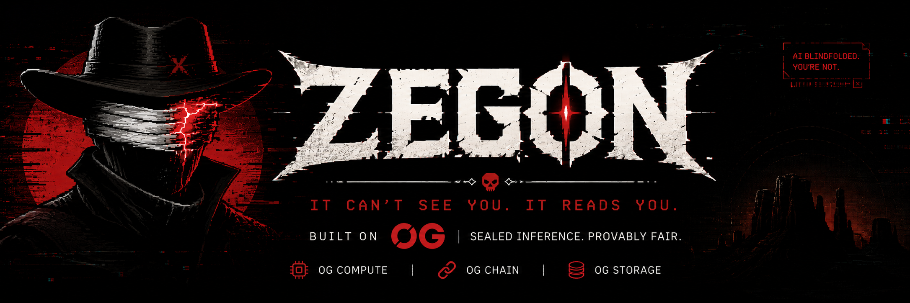

<div align="center">



<br /><br />

[![website][website-shield]][website-link]
[![play][game-shield]][game-link]
[![github stars][github-star]][github-link]
[![built on 0G][og-shield]][og-link]

</div>

### 👋 Welcome to Zegon Labs

We're building **provably fair AI gaming** — where the opponent can't cheat, and you can prove it.

Most AI opponents run on opaque servers. When you lose, you wonder if the house rigged the read or rewrote its move after seeing yours — and you can never know. **ZEGON** is our answer: a pixel-art gunslinger duel against a blindfolded AI that *reads your patterns* but **cannot see your current move**. Every round leaves on-chain proof that ZEGON committed before you acted.

Built on **0G** (Compute + Chain + Storage) for the **Zero Cup 2026** hackathon. The repositories below are the open-source layers — playable today, forkable tomorrow.

### ⭐️ Our Projects

| Project | Description |
| :--- | :--- |
| [**🤠 ZEGON DApp**][dapp-github] | Turn-based duel vs a blindfolded AI with sealed inference on 0G Compute. Commit-reveal on Galileo, read-streak / DEADEYE, items, tutorial, daily pool, global leaderboard, VERIFY flow. Play free — wallet only at the end for ranking. [![][game-shield]][game-link] [![][contract-shield]][contract-link] |
| [**🌐 ZEGON Landing**][landing-github] | Official marketing site — provably fair AI gaming, commit flow preview, 0G stack breakdown, FAQ, and launch overlay into the dapp. [![][website-shield]][website-link] |

### 📦 Ecosystem

| Repository / Package | Purpose | Language |
| :--- | :--- | :---: |
| [**🎮 Zegon-DApp**][dapp-github] | Monorepo — Phaser 3 client, Node API, Solidity contracts, full 0G integration | ![][lang-typescript] |
| [**🌐 Zegon-Landing**][landing-github] | Vite + React landing page with dark neo-western glitch design system | ![][lang-typescript] |
| `packages/game-core` | Pure duel logic — combat, read streak, DEADEYE, items, archetypes, scoring | ![][lang-typescript] |
| `packages/game-client` | Phaser 3 + Vite client (1280×720, sprite HUD, tutorial, i18n EN/ES) | ![][lang-typescript] |
| `packages/game-server` | Node API — 0G Compute inference, chain commit-reveal, Storage uploads, daily pool, leaderboard | ![][lang-typescript] |
| `contracts/` | `ZegonDuel.sol`, `ZegonLeaderboard.sol`, `ZegonDailyPool.sol` on Galileo | ![][lang-solidity] |

### 🏗️ How It Fits Together

```
                    ZEGON Landing (marketing)
                              │
                         launches into
                              ▼
                    ZEGON DApp (Phaser client)
                              │
              ┌───────────────┼───────────────┐
              │               │               │
         reads history    commits hash    uploads proof
              ▼               ▼               ▼
       ┌────────────┐  ┌────────────┐  ┌────────────┐
       │ 0G Compute │  │  0G Chain  │  │ 0G Storage │
       │            │  │  (Galileo) │  │            │
       │ sealed TEE │  │ commit-    │  │ duel log + │
       │ inference  │  │ reveal     │  │ attestation│
       └────────────┘  └────────────┘  └────────────┘
              │               │               │
              └───────────────┴───────────────┘
                              │
                    VERIFY after every duel
                    (session token + on-chain fallback)
```

**Per-round flow:** ZEGON receives only your action history → sealed inference on 0G Compute → `commitMove(hash)` on-chain **before** your buttons unlock → you choose **FIRE**, **DODGE**, or an item → `revealMove` → resolve damage (5 lives) → read streak updates. After the duel: `recordDuel` + blob upload to 0G Storage → **VERIFY ON-CHAIN** at `/api/duel/verify/:duelId`.

### 🎯 What Makes ZEGON Different

| | Typical AI game | ZEGON |
| :--- | :--- | :--- |
| When you lose | Was it rigged? | You can check |
| AI move timing | Hidden server | Locked first |
| Can the house cheat? | You'd never know | Proof exposes it |
| Does the duel feel real? | Often hollow | Stakes land |

**Tagline:** *"It can't see you. It reads you. Outdraw the blind."*

**The wedge:** provably fair today covers RNG (dice, casino). ZEGON applies it to **AI decisions with hidden information** — sealed inference proves the model only saw your history; commit-reveal proves it locked in before you moved.

### ⚔️ Core Gameplay (current build)

- **Actions:** `FIRE`, `DODGE`, and one-click **items** — Smoke (break read), Plate (block shot), Mirror (reflect).
- **Read streak:** 2/2 ticks in the header HUD → **DEADEYE** (lethal read if ZEGON predicted you).
- **5 lives** shown as hearts/skulls — no opaque HP numbers.
- **Tutorial:** 9 lessons + 6 guided practice rounds before your first real duel.
- **Modes:** Standard (ZEGON archetypes) and **Daily duel** with on-chain stake pool.
- **Wallet optional:** play free; connect at the end to submit your best score to the global leaderboard.
- **i18n:** English and Spanish, including in-game settings mid-duel.

### 🔗 On-Chain (Galileo testnet)

| | |
| :--- | :--- |
| **ZegonDuel** | [`0x2Fc47e82c30B9d1B9193fa1978E96A92d7b760b0`][contract-link] |
| **ZegonDailyPool** | [`0xF0011177988a323d2dFE4CFD29D2dFC2199F44ea`][pool-link] |
| **Chain ID** | `16602` |
| **RPC** | `https://evmrpc-testnet.0g.ai` |
| **Explorer** | [chainscan-galileo.0g.ai][explorer-link] |
| **Faucet** | [faucet.0g.ai][faucet-link] |

Backend sponsors gas on testnet so anyone can play without a wallet.

### 🤝 Contributing

We welcome PRs, bug reports, and gameplay feedback across every public repository.

- **Game logic** — extend `packages/game-core` (combat rules, items, modes).
- **0G integration** — improve Compute prompts, chain flows, or Storage persistence in `game-server`.
- **Visual / UX** — Phaser scenes, HUD, tutorial, or landing sections in their respective repos.
- **Docs** — pitch source in [`ZERO_CUP_PITCH.md`][pitch-doc] inside Zegon-DApp.

### 🪪 License

Per-repository. See individual repositories for license details.

---

> [!TIP]
>
> **Play now:** [Launch ZEGON][game-link] → complete the tutorial → duel the blind AI → hit **VERIFY ON-CHAIN** after the fight. Fair dice already exist. ZEGON proves the *mind* is fair.

[website-link]: https://zegon-landing.vercel.app
[website-shield]: https://img.shields.io/badge/website-zegon--landing.vercel.app-B3122B?labelColor=0A0911&style=flat-square&logo=safari&logoColor=white

[game-link]: https://zegon-dapp.vercel.app
[game-shield]: https://img.shields.io/badge/play-zegon--dapp.vercel.app-B3122B?labelColor=0A0911&style=flat-square&logo=gamepad&logoColor=white

[github-link]: https://github.com/Zegon-Labs
[github-star]: https://img.shields.io/github/stars/Zegon-Labs?color=B3122B&labelColor=0A0911&style=flat-square&logo=github

[og-link]: https://0g.ai
[og-shield]: https://img.shields.io/badge/built%20on-0G-B3122B?labelColor=0A0911&style=flat-square&logo=data:image/svg+xml;base64,PHN2ZyB4bWxucz0iaHR0cDovL3d3dy53My5vcmcvMjAwMC9zdmciIHZpZXdCb3g9IjAgMCAyNCAyNCIgZmlsbD0ibm9uZSIgc3Ryb2tlPSJ3aGl0ZSIgc3Ryb2tlLXdpZHRoPSIyIiBzdHJva2UtbGluZWNhcD0icm91bmQiIHN0cm9rZS1saW5lam9pbj0icm91bmQiPjxjaXJjbGUgY3g9IjEyIiBjeT0iMTIiIHI9IjEwIi8+PC9zdmc+&logoColor=white

[dapp-github]: https://github.com/Zegon-Labs/Zegon-DApp
[landing-github]: https://github.com/Zegon-Labs/Zegon-Landing

[contract-link]: https://chainscan-galileo.0g.ai/address/0x2Fc47e82c30B9d1B9193fa1978E96A92d7b760b0
[pool-link]: https://chainscan-galileo.0g.ai/address/0xF0011177988a323d2dFE4CFD29D2dFC2199F44ea
[contract-shield]: https://img.shields.io/badge/contract-Galileo-B3122B?labelColor=0A0911&style=flat-square&logo=ethereum&logoColor=white

[explorer-link]: https://chainscan-galileo.0g.ai
[faucet-link]: https://faucet.0g.ai
[pitch-doc]: https://github.com/Zegon-Labs/Zegon-DApp/blob/main/ZERO_CUP_PITCH.md

[lang-typescript]: https://img.shields.io/badge/typescript-B3122B?labelColor=0A0911&style=flat-square&logo=typescript&logoColor=white
[lang-solidity]: https://img.shields.io/badge/solidity-B3122B?labelColor=0A0911&style=flat-square&logo=solidity&logoColor=white
